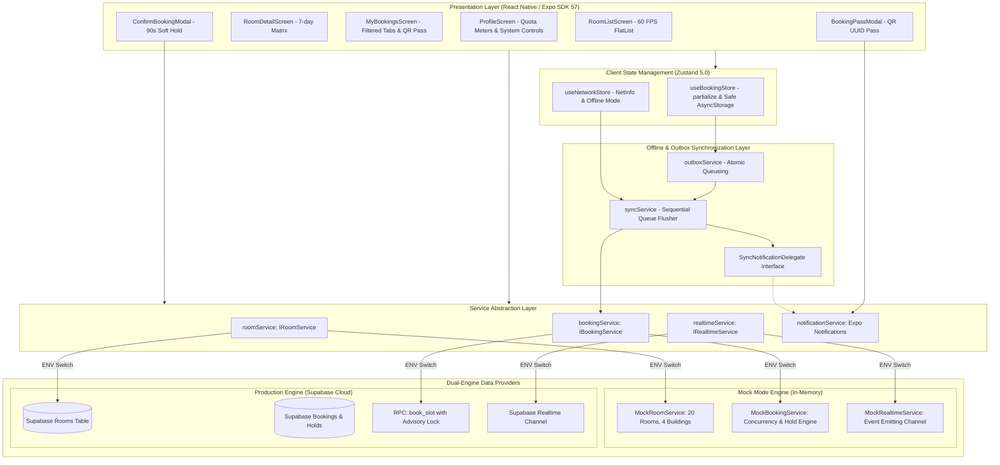

# VKU Study Room Booking App — Architecture Documentation

## 1. System Overview

The **VKU Study Room Booking App** is an academic cross-platform mobile application designed for students of Vietnam - Korea University of Information and Communication Technology (VKU) to discover, reserve, manage, and check in to campus study rooms in real time.

The project strictly follows a **Modular Dual-Mode Architecture**, allowing it to run either against a production **Supabase (PostgreSQL 15+)** backend with Realtime subscriptions, or completely standalone in **Mock Mode** with in-memory concurrent simulation and zero external credentials.

---

## 2. Architecture Diagram



---

## 3. Layered Design & Separation of Concerns

### 3.1 Presentation Layer (`src/screens`, `src/components`)
- **Strictly Functional & Declarative**: Built entirely with React 19 functional components and TypeScript strict types.
- **Component Memoization**: Components like `RoomCard`, `SlotCell`, `FilterChips`, and `DateSelector` use `React.memo` with custom shallow comparators where appropriate to avoid unnecessary re-renders.
- **Accessible & Touch-Friendly**: All interactive elements satisfy accessibility guidelines with explicit `accessibilityRole`, `accessibilityLabel`, and minimum 48x48 pt touch bounds.

### 3.2 State Management Layer (`src/store`)
- **Zustand with Selective Subscriptions**: Screens and components subscribe to fine-grained state slices via selector functions (e.g., `useBookingStore(state => state.myBookings)`), preventing wide tree re-renders.
- **Resilient Persistence**: `safeAsyncStorage` wraps `@react-native-async-storage/async-storage` with an in-memory `Map` fallback, ensuring uninterrupted operation during test runners (Node.js/`tsx`) and web previews.
- **Selective Hydration**: `partialize` ensures only long-lived entities (student credentials, cached rooms, cached availability, local bookings, outbox items) persist to disk, while ephemeral UI states (selected slot index, modals) reset cleanly.

### 3.3 Offline Outbox & Synchronization Layer (`src/services`)
- **Offline-First Contract**: When a student books offline, the request is immediately recorded into the persistent `outbox` with status `PENDING_SYNC`. **Crucially, offline bookings are NEVER marked as `CONFIRMED` locally.**
- **Sequential Queue Flushing**: `syncService.flushOutboxSequentially()` processes pending outbox items one-by-one using `for...of` loops and transactional delays (80ms). It **strictly avoids `Promise.all()`** to preserve deterministic causality.
- **Dependency Inversion**: Uses `SyncNotificationDelegate` to decouple notification delivery from the sync engine, maintaining 100% pure TypeScript testability under Node.js.

### 3.4 Hardware & Native OS Layer
- **Expo Notifications**: Schedules 15-minute advance reminders for `CONFIRMED` bookings and broadcasts instant system alerts when sync conflicts occur.
- **QR Code Engine**: `react-native-qrcode-svg` generates standard high-density 2D barcodes containing strictly the booking UUID.

### 3.5 Database & Backend Layer (`supabase/schema.sql`)
- **PostgreSQL 15+ Core**: Utilizes transaction isolation, Row Level Security (RLS), and database-level validation.
- **Advisory Locking**: `pg_advisory_xact_lock(hashtext(...))` serializes concurrent transactions requesting the exact same `(room_id, booking_date, slot_index)`.
- **Active Partial Unique Index**: `idx_bookings_active_slot` ensures hard integrity even in the event of hypothetical race conditions across distributed instances.

---

## 4. Directory & File Organization

```
vku-study-room/
├── App.tsx                        # Root application entry & notification setup
├── app.json                       # Expo configuration & app manifest
├── docs/                          # Academic documentation & specifications
│   ├── architecture.md            # System architecture (this document)
│   ├── concurrency.md             # Concurrency, advisory lock & soft holds
│   ├── offline-outbox.md          # Offline queue & deterministic sync
│   └── performance.md            # 60 FPS FlatList & memory optimization
├── src/
│   ├── components/                # Atomic UI components
│   │   ├── BookingCard.tsx        # Card display with status badges
│   │   ├── BookingPassModal.tsx   # QR code student pass modal
│   │   ├── ConfirmBookingModal.tsx# 90s soft-hold booking modal
│   │   ├── DateSelector.tsx       # 7-day rolling horizon date picker
│   │   ├── EmptyState.tsx         # Graphic empty & error states
│   │   ├── FilterChips.tsx        # Filter chips for buildings & capacity
│   │   ├── NetworkBanner.tsx      # Offline status banner with timestamp
│   │   ├── RoomCard.tsx           # Fixed-height 60 FPS room card
│   │   ├── SearchBar.tsx          # Fast keyword filter bar
│   │   ├── SlotCell.tsx           # Color-coded slot block with status
│   │   └── SlotGrid.tsx           # Matrix of 4 daily slots
│   ├── config/
│   │   └── environment.ts         # Dual-mode switch & credentials
│   ├── hooks/
│   │   ├── useNetworkStatus.ts    # NetInfo listener with manual offline toggle
│   │   └── useRoomAvailability.ts # Realtime availability subscription
│   ├── navigation/
│   │   ├── MainTabs.tsx           # Bottom navigation tabs (Rooms, My Bookings, Profile)
│   │   └── RootNavigator.tsx      # Native Stack navigator (Modal routes)
│   ├── screens/
│   │   ├── MyBookingsScreen.tsx   # Filtered booking management
│   │   ├── ProfileScreen.tsx      # Quota meters & demo reset controls
│   │   ├── RoomDetailScreen.tsx   # Room schedule & booking orchestrator
│   │   └── RoomListScreen.tsx     # 60 FPS room discovery screen
│   ├── services/                  # Business logic & data access
│   │   ├── bookingService.ts      # Active service router
│   │   ├── notificationService.ts # Local push notification manager
│   │   ├── outboxService.ts       # Offline outbox queue manager
│   │   ├── realtimeService.ts     # Realtime broadcast router
│   │   ├── roomService.ts         # Room list service router
│   │   ├── syncService.ts         # Sequential outbox flusher
│   │   ├── types.ts               # Service interfaces
│   │   ├── mock/                  # Standalone mock implementation
│   │   └── supabase/              # Production Supabase PostgreSQL client
│   ├── store/
│   │   ├── useBookingStore.ts     # Primary application store (Zustand)
│   │   └── useNetworkStore.ts     # Network & sync state store
│   ├── types/                     # TypeScript domain models
│   │   ├── booking.ts             # Booking, Hold & Status types
│   │   ├── navigation.ts          # Type-safe React Navigation routes
│   │   ├── quota.ts               # VKU quota definitions & limits
│   │   ├── room.ts                # Room & Filter interfaces
│   │   ├── slot.ts                # 4 discrete daily slot definitions
│   │   └── sync.ts                # Outbox item definitions
│   └── utils/
│       ├── availability.ts        # Deterministic slot priority resolver
│       ├── date.ts                # Date formatting & 15m trigger calculation
│       ├── errors.ts              # Error mapper (Postgres 23505 -> SLOT_ALREADY_BOOKED)
│       └── idempotency.ts         # UUID v4 idempotency token generator
├── supabase/
│   ├── schema.sql                 # DDL, advisory lock stored procedure, RLS
│   └── seed.sql                   # 20 university study rooms across 4 buildings
└── test/                          # Automated verification test suites
    ├── concurrency-test.ts        # Advisory lock, 23505, Quota & Hold tests
    ├── notifications-qr.test.ts   # 15m notification triggers & QR security
    ├── offline-outbox-conflict.test.ts # Outbox sequential sync & conflict tests
    └── setup.ts                   # Test environment bootstrap
```
