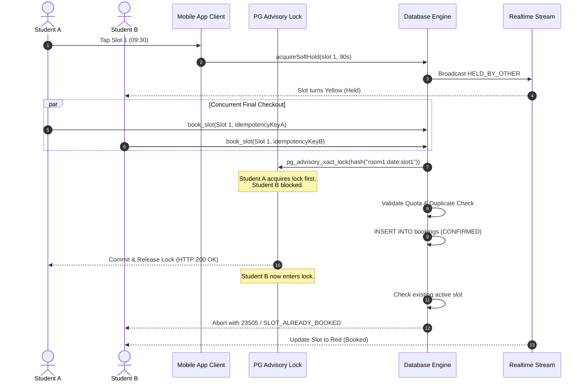

# VKU Study Room Booking App — Concurrency & Integrity Strategy

## 1. The Concurrency Challenge (TOCTOU)

In high-demand academic environments like university room reservations during exam periods, hundreds of students concurrently view and attempt to book the same prime study slots. 

A naive implementation that checks availability with `SELECT ... WHERE status = 'CONFIRMED'` and then executes an `INSERT` suffers from a **Time-of-Check to Time-of-Use (TOCTOU)** race condition. If two requests execute the check at the same millisecond, both conclude the room is free, leading to catastrophic **double booking**.

The VKU Study Room Booking App eliminates race conditions through **Four Coordinated Defensive Layers**.

---

## 2. Four Layers of Defensive Architecture



### Layer 1: 90-Second Soft Hold (`create_hold` / `release_hold`)
- When a student selects an available slot to view the confirmation modal, a **90-second soft hold** is registered with an exact expiration timestamp (`expires_at = now() + interval '90 seconds'`).
- The realtime channel immediately broadcasts this hold to all connected peers, turning the slot status to **`HELD_BY_OTHER`** (Amber badge).
- Other students are prevented from starting a checkout on that slot.
- If the modal is closed or 90 seconds elapse without confirmation, the hold releases automatically and the slot returns to `AVAILABLE`.

### Layer 2: Transactional Advisory Locking (`pg_advisory_xact_lock`)
- Soft holds protect against casual overlapping clicks, but cannot guarantee transactional integrity against malicious or concurrent API requests hitting the server at the exact same microsecond.
- The PostgreSQL stored procedure `book_slot()` computes a deterministic 64-bit integer hash of the room, date, and slot index:
  ```sql
  PERFORM pg_advisory_xact_lock(hashtext(p_room_id || ':' || p_booking_date::text || ':' || p_slot_index::text));
  ```
- Because this is an **exclusive transaction-level advisory lock** (`xact_lock`), it automatically serializes all concurrent operations targeting the exact same physical slot until the transaction commits or aborts.

### Layer 3: Partial Unique Index (`idx_bookings_active_slot`)
- Even if an advisory lock was somehow bypassed, PostgreSQL enforces absolute integrity at the table storage layer via a **partial unique index**:
  ```sql
  CREATE UNIQUE INDEX idx_bookings_active_slot
  ON bookings (room_id, booking_date, slot_index)
  WHERE status = 'CONFIRMED';
  ```
- Any second transaction attempting to insert a row with identical `(room_id, booking_date, slot_index)` where `status = 'CONFIRMED'` immediately triggers standard PostgreSQL error code **`23505` (`unique_violation`)**.
- The client application translates this low-level code into a human-friendly error enum:
  ```ts
  if (err.code === '23505' || err.message?.includes('unique_violation')) {
    return {
      success: false,
      errorCode: 'SLOT_ALREADY_BOOKED',
      errorMessage: 'This slot was just taken by another student.',
    };
  }
  ```

### Layer 4: Client-Side UUID Idempotency Keys
- Mobile network drops can cause request retries when an HTTP response is lost mid-flight.
- Each booking request generates a client-side UUID v4 idempotency token before dispatching:
  ```ts
  const idempotencyKey = generateIdempotencyKey(); // e.g. "idem-1789923004725-t7epq"
  ```
- The stored procedure first inspects `bookings` for an existing record with the supplied `idempotency_key`. If found, it returns the **original booking record** without creating duplicates or decrementing student quotas twice.

---

## 3. Strict Quota Enforcement Rules

Inside the atomic stored procedure (and mirrored in the local mock engine), three university quotas are verified:

| Quota Dimension | Limit | Enforcement Rule | Error Code |
| :--- | :--- | :--- | :--- |
| **Daily Quota** | Max 2 slots / day | `COUNT(*) WHERE booking_date = target_date` | `DAILY_QUOTA_EXCEEDED` |
| **Weekly Quota** | Max 6 slots / week | `COUNT(*) WHERE booking_date BETWEEN (now - 3d) AND (now + 3d)` | `WEEKLY_QUOTA_EXCEEDED` |
| **Active Future Limit** | Max 3 future slots | `COUNT(*) WHERE booking_date >= today` | `MAX_FUTURE_EXCEEDED` |

---

## 4. Verification Test Results (`npm run test:concurrency`)

All four concurrency scenarios are automatically verified by the project test suite:

```bash
> tsx -r ./test/setup.ts test/concurrency-test.ts

TEST 1: Simulating two concurrent booking attempts for the same slot...
- Result A: success=true, errorCode=NONE
- Result B: success=false, errorCode=SLOT_ALREADY_BOOKED
✅ TEST 1 PASSED: Exactly one booking succeeded and one received SLOT_ALREADY_BOOKED.

TEST 2: Testing idempotency key replay...
- First Attempt: success=true, isReplay=false
- Replay Attempt: success=true, isReplay=true
✅ TEST 2 PASSED: Replay with same idempotency key returned original booking with 0 duplicates.

TEST 3: Testing Daily Quota Enforcement (Max 2 slots)...
- 1st daily booking: success=true
- 2nd daily booking: success=true
- 3rd daily booking: success=false, errorCode=DAILY_QUOTA_EXCEEDED
✅ TEST 3 PASSED: Server correctly rejected 3rd booking on the same day with DAILY_QUOTA_EXCEEDED.

TEST 4: Testing Soft Hold creation and availability check...
- Hold created: success=true, holdId=hold-1789923045658-4v3ll
- State for other student while held: HELD_BY_OTHER
- State for other student after release: AVAILABLE
✅ TEST 4 PASSED: Soft hold correctly locked slot for 90s and freed immediately on release.
```
