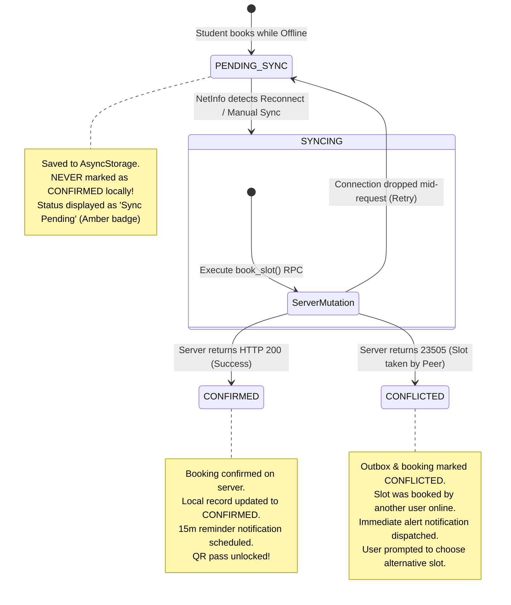

# VKU Study Room Booking App — Offline Outbox & Sync Strategy

## 1. The Offline Challenge in Campus Environments

University campuses often suffer from connectivity blackouts: students walking through basements, elevators, lecture halls with crowded Wi-Fi access points, or switching between 4G and eduroam.

Without an offline strategy, a mobile app either crashes, blocks user actions with blocking spinners, or falsely promises that an offline booking is confirmed when the room may already be taken on the server.

The VKU Study Room Booking App implements a **Transactional Sequential Outbox Pattern** to provide continuous user productivity while maintaining server authority.

---

## 2. Outbox Lifecycle & State Transitions



---

## 3. Core Architectural Rules

### Rule 1: No False Confirmations
When offline, the client **never** marks a booking as `CONFIRMED`. The booking is added to `myBookings` and `outbox` strictly with status **`PENDING_SYNC`**. The UI shows an amber badge (`Pending Sync`) and disables the QR Check-in Pass until server verification is achieved.

### Rule 2: Strictly Sequential Queue Processing
The outbox flusher **strictly forbids `Promise.all()`**:
```ts
// src/services/syncService.ts
for (const item of pendingItems) {
  processedCount++;
  const result = await this.processSingleItem(item);
  // Transactional pause for causality stability
  await new Promise((resolve) => setTimeout(resolve, 80));
}
```
**Why parallel execution is banned**:
1. If a student queues 2 bookings offline, processing them concurrently could cause race conditions with their own daily quota (max 2 slots/day).
2. If one booking is a cancellation and another is a booking for a freed slot, parallel execution could process the booking before the cancellation commits, leading to false rejections.

### Rule 3: Deterministic Conflict Resolution
If another student claimed the slot while the local device was offline, the server rejects the synchronization with `SLOT_ALREADY_BOOKED`. The sync flusher:
1. Marks the outbox item as `CONFLICTED`.
2. Marks the local booking as `CONFLICTED`.
3. Stores the human error message: `"This slot was just taken by another student before reconnection."`
4. Automatically fires a high-priority local push notification alerting the student immediately.

---

## 4. Reconnect Synchronization Protocol

1. **NetInfo Event Listener**:
   `useNetworkStatus` continuously listens to network connection state. Upon transitions from `isConnected: false` $\rightarrow$ `isConnected: true`, `syncService.flushOutboxSequentially()` is automatically triggered.
2. **Network Banner Indicator**:
   When offline, `NetworkBanner` displays a persistent top banner:
   > *"Offline Mode — Showing cached data as of 14:30. Bookings will sync automatically on reconnect."*
3. **Manual Trigger Fallback**:
   Students can manually trigger a sync via the "Sync Pending Outbox" button in the Profile screen or by pulling to refresh the My Bookings screen.

---

## 5. Verification Test Results (`npm run test:outbox`)

The offline outbox and conflict resolution lifecycle is verified end-to-end via automated testing:

```bash
> tsx -r ./test/setup.ts test/offline-outbox-conflict.test.ts

========================================================
STARTING PHASE P4 OFFLINE OUTBOX & CONFLICT RESOLUTION
========================================================

STEP 1: Student A goes offline and attempts to book Slot 1...
- Queued outbox item ID: outbox-1789923046379-6q3g5
- Outbox item initial status: PENDING_SYNC
- Local client booking status: PENDING_SYNC
✅ STEP 1 PASSED: Booking saved to outbox as PENDING_SYNC without local confirmation.

STEP 2: While Student A is offline, Student B reserves Slot 1 online...
- Student B booking result: success=true, status=CONFIRMED
✅ STEP 2 PASSED: Student B confirmed the slot on the server.

STEP 3: Student A reconnects to internet -> Sequential outbox flush triggered...
- Outbox Flush summary: processed=1, confirmed=0, conflicted=1
- Updated outbox status: CONFLICTED
- Updated outbox last error: This slot was just taken by another student.
- Updated local booking status: CONFLICTED
✅ STEP 3 PASSED: Sequential flush correctly detected conflict and marked CONFLICTED.

========================================================
ALL PHASE P4 OFFLINE & OUTBOX TESTS PASSED! 🎉
========================================================
```
